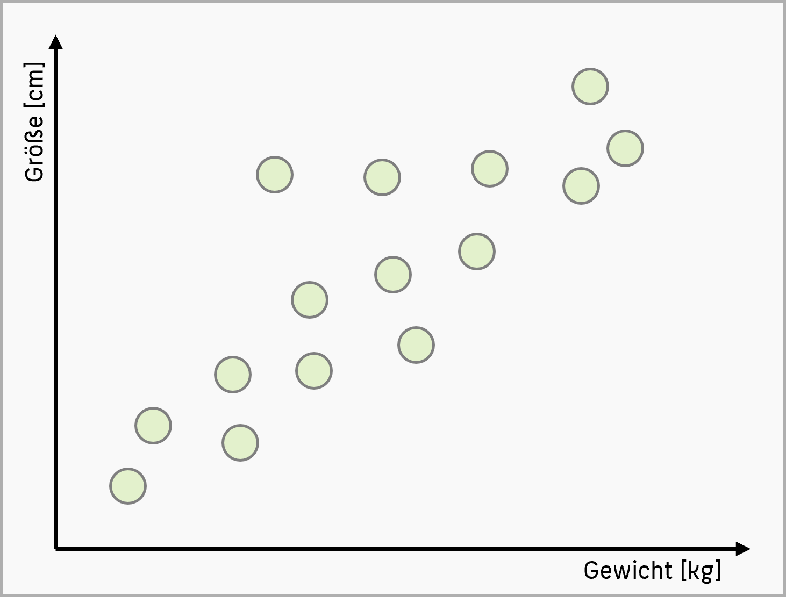
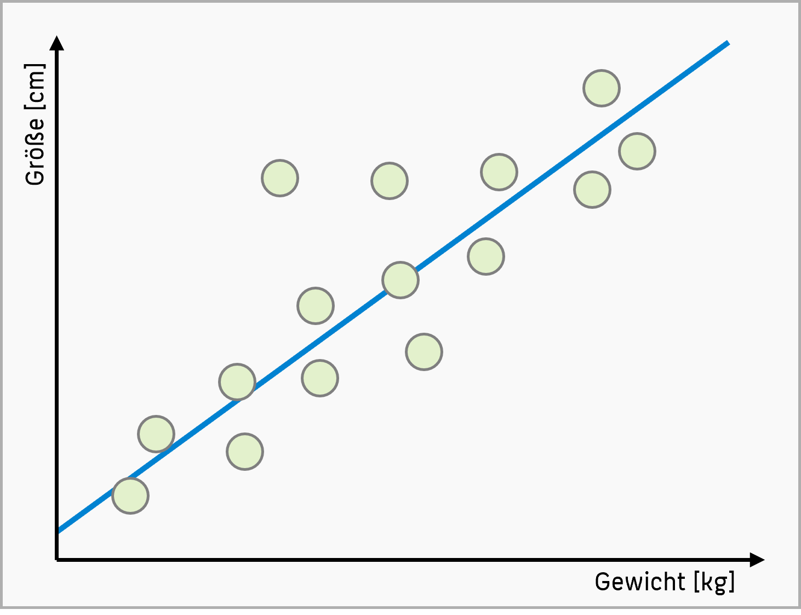
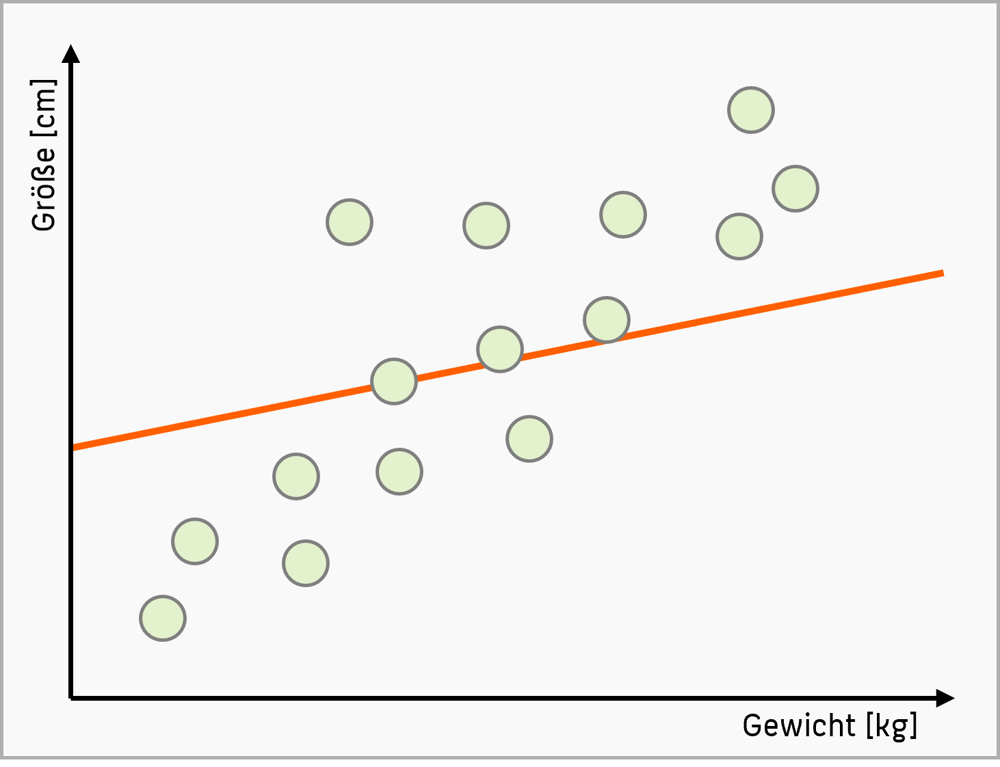

**Hinweis:** Wir greifen an dieser Stelle der Erklärung von Regressionsverfahren vorweg, die später in der Vorlesung erneut erkärt werden. Sie können die berühmte _Methode der kleinsten Quadrate_ schon jetzt studieren oder zu einem späteren Zeitpunkt hierher zurückkehren. Für den Verlauf von Vorlesung 04 ist der Beweis zunächst optional.
{: .notice--introduction} 

**Hinweis (optional):** Wenn Sie wünschen, können Sie mit einem Notebook zur [Least Squares Demo](LeastSquaresDemo.ipynb) die Funktionsweise der linearen Regression im Code nachvollziehen.
{: .notice--info} 


## Lineare Zusammenhänge

In vergangenen Vorlesungen haben wir uns bereits mit der Korrelation zwischen Merkmalen in Daten beschäftigt. Ganz intuitiv wissen wir, dass zwischen Variablen eine lineare Abhängigkeit bestehen kann. 

Aus der Schule sind uns lineare Abhängigkeiten bekannt über die Gleichung
$$
y=ax+b
$$
für den eindimensionalen Merkmalsraum, oder
$$
y=\beta_1 x_1 + \beta_2 x_2 + \ldots + \beta_n x_n + \beta_0
$$
oder, in Vektor-Schreibweise:
$$
y=x^T \beta
$$
für den $$n$$-dimensionalen Merkmalsraum (das $$\beta_0$$ lösen wir durch ein zusätzliches Dummy-Merkmal mit konstantem Wert 1).

Für $$k$$ konkrete Beobachtungen (=Werte, Messungen) in einem Vektor y ergibt sich dann die Matrixschreibweise 
$$
y=X \beta
$$

Ein typisches praktisches Beispiel ist der Zusammenhang zwischen _Größe_ und _Gewicht_ von Dingen oder Personen. In der Grafik sehen wir das Ergebnis einer Datenerhebung, die klar einen linearen Zusammenhang erkennen lässt:




Aber wie finden wir die konkreten Gewichte dieses Zusammenhangs? Welche Linie beschreibt die Daten am besten (in der Sprache des maschinellen Lernens formuliert: welches Modell hat die Maximum Likelihood in Anbedtract unseres Datensatzes?).

Intutiv sehen wir, dass die im Beispiel unten die blaue Linie besser zu den Daten passt als die rote:



Mathematisch formuliert ist dies klar, weil die blaue Linie, ausgedrückt durch einen Parametervektor $$\beta$$, die Abweichung der einzelnen Datenpunkte zur Projektion auf der Linie minimiert (Projektion: Senkrechte durch den Punkt hin zur blauen Linie):
$$
\min_\beta ||X\beta-y||^2_2
$$
Vereinfacht gesagt: die Punkte sind einfach "näher dran" an der blauen Linie als an der roten. Deshalb ist das $$\beta$$, das diese beschreibt, das bessere von beiden.


Das $$\beta$$, das diese Funktion minimiert, lässt sich analytisch bestimmen, die Methode dazu bezeichnet man als **Ordinary Least Squares**. 


## Methode der kleinsten Quadrate (N-dimensionaler Fall)

Die Methode der kleinsten Quadrate wird im  $$N$$-dimensionalen Fall verwendet, um eine Regressionsfunktion zu finden, die eine Menge von Beobachtungen $$(x_i, y_i)$$ am besten approximiert. Im Vektorraum ist das das Modell:

$$
\mathbf{y} = \mathbf{X} \boldsymbol{\beta} + \boldsymbol{\epsilon}
$$

Ziel ist es, den Parametervektor $$\beta$$ zu finden, der die Summe der quadrierten Abweichungen zwischen den vorhergesagten Werten $$X \beta$$ und den beobachteten Werten $$y$$ minimiert. Dies bedeutet, wir minimieren die quadratische Verlustfunktion:

$$
S(\boldsymbol{\beta}) = \| \mathbf{y} - \mathbf{X} \boldsymbol{\beta} \|^2 = (\mathbf{y} - \mathbf{X} \boldsymbol{\beta})^\top (\mathbf{y} - \mathbf{X} \boldsymbol{\beta})
$$

### Schritt 1: Ableitung der Verlustfunktion

Zuerst leiten wir die Verlustfunktion $$S(\beta)$$ nach $$\beta$$ ab:

$$
\frac{\partial S(\boldsymbol{\beta})}{\partial \boldsymbol{\beta}} = -2 \mathbf{X}^\top (\mathbf{y} - \mathbf{X} \boldsymbol{\beta})
$$

### Schritt 2: Bedingung für ein Minimum

Um ein Minimum der Verlustfunktion zu finden, setzen wir die Ableitung gleich Null:

$$
-2 \mathbf{X}^\top (\mathbf{y} - \mathbf{X} \boldsymbol{\beta}) = 0
$$

### Schritt 3: Lösung für $$\beta$$

Durch Umformen erhalten wir:

$$
\mathbf{X}^\top \mathbf{y} = \mathbf{X}^\top \mathbf{X} \boldsymbol{\beta}
$$

Die Lösung für $$\beta$$ ergibt sich daher als:

$$
\boldsymbol{\beta} = (\mathbf{X}^\top \mathbf{X})^{-1} \mathbf{X}^\top \mathbf{y}
$$

### Voraussetzung für die Lösung

Damit $$\beta$$ eindeutig bestimmt ist, muss $$X^\top X$$ invertierbar sein, das heißt, die Matrix $$X$$ muss vollen Rang haben. Wenn dies der Fall ist, gibt es eine eindeutige Lösung für das kleinste-Quadrate-Problem.

Das heißt intutiv: wenn unsere Featurematrix statistisch "freundlich" ist, dann können wir $$\beta$$ einfach ausrechnen durch ein bisschen Matrixinvertierung etc. auf den Daten. Wenn das nicht der Fall ist (passiert häufig, wenn Merkmale inhaltlich überlappen und damit nicht mehr unabhängig voneinander sind), dann können wir $$X$$ nicht invertieren. Das heißt es gibt möglicherweise mehrere Lösungen für $$\beta$$. Für so etwas gibt es ebenfalls Lösungen, z.B. Lasso, Ridge und Elastic Net Regression.
{: .notice--info} 

### Ergebnis

Der geschätzte Parametervektor $$\beta$$ minimiert die Summe der quadrierten Residuen und liefert die beste lineare Approximation der Beobachtungen im Sinne der kleinsten Quadrate.


## Implementierung

Die Implementierung zum Finden eines Modells, dass diese Linie (bzw. Hyperebene) bzw. den Gewichtsvektor $$\beta$$ beschreibt, bezeichnet man als **Lineare Regression**.


Der Code, um eine solche Regression umzusetzen, ist denkbar einfach:

```python
import numpy as np
from sklearn.linear_model import LinearRegression

# Example data
X = np.array([[1, 1], [1, 2], [2, 2], [2, 3]])
# y = 1 * x_0 + 2 * x_1 + 3
y = np.dot(X, np.array([1, 2])) + 3

# Fit the model
reg = LinearRegression().fit(X, y)

# Model evaluation
score = reg.score(X, y)
coefficients = reg.coef_
intercept = reg.intercept_

print(f"R-squared score: {score:.2f}")
print(f"Coefficients: {coefficients}")
print(f"Intercept: {intercept:.2f}")
print(f"Predicted value for new data: {predicted_value[0]:.2f}")
```

## Anwendungen linearer Regression

Aber warum sollte man sich überhaupt für die genaue Bestimmung eines linearen Zusammenhangs interessieren? Ein wichtiger Aspekt ist die Anwendung des Modells als Vorhersage. In unserem konkreten Beispiel könnten wir unser gelerntes Modell verwenden, um die Zielvariable $$y$$ bei neuen, bisher unbekannten Eingabedaten $$X$$ vorherzusagen:

```python
new_data = np.array([[3, 5]])
predicted_value = reg.predict(new_data)
print(f"Predicted value for new data: {predicted_value[0]:.2f}")
```
